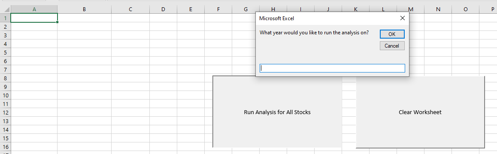
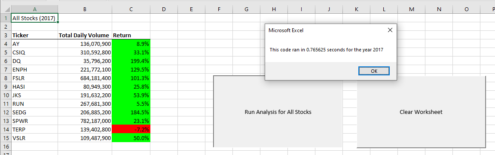
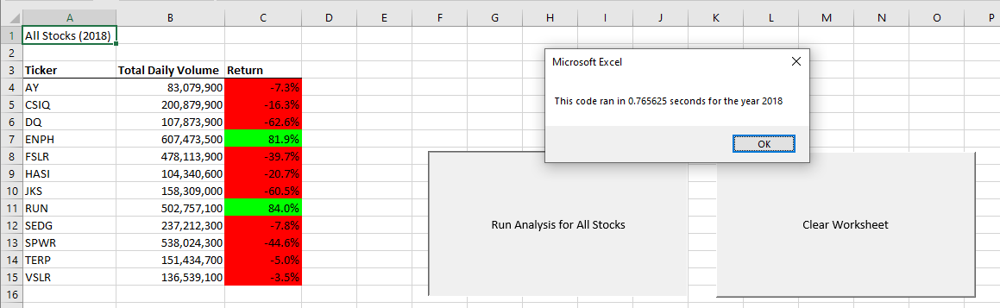
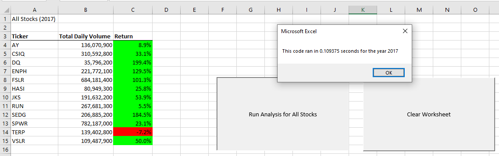
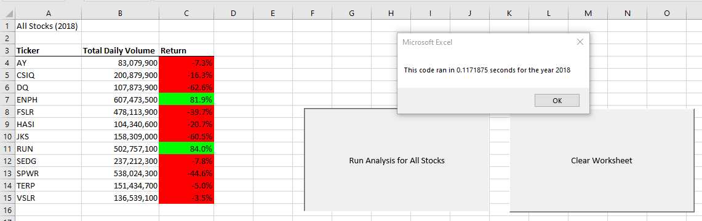

# Stock Market Analysis using VBA

## Resources
- Data source: green_stocks.xlsx
- Software: Microsoft Excel Version 2302

## Project Objectives

**Analyze the Stock data provided to identify the optimal investment options.**
1. Using the VBA editor within Excel, create a sequence of actions, also known as a macro, to calculate the total daily volume and yearly return of all stocks and assign that macro to a button. 
2. The button should allow the user to input the specific year they want to analyze. The time taken for the macro to run should also pop up in a message box for the user.
2. Lastly, create a macro to clear the worksheet so that the analysis can be rerun without issues.

**After the Stock data has been analyzed,**
1. Refactor the code used for creating the first button to improve efficiency and logic, and reduce memory usage. The time taken for the new macro to run should also pop up in a message box for the user so that they can compare execution times between the original code and the refactored code.

## Results & Analysis

Below is the intial view that the user sees when they click on the *"Run Analysis for All Stocks"* button. A message box pops up allowing the user to input which year they want to run the analysis on. In the case of the provided dataset, the user can choose between the year *2017* or *2018*.

For the year 2017, 11 of the 12 stocks in the dataset were positive, suggesting that they would be good stocks to invest in. The execution time using my original code was 0.76 seconds.

For the year 2018, 10 of the 12 stocks in the dataset were negative, suggesting that they would be bad stocks to invest in. The execution time using my original code was 0.76 seconds.

In the image below, we can see that my refactored code provides the same results as the original code for the year 2017, but my execution time has improved to 0.10 seconds.

In the image below, we can see that my refactored code provides the same results as the original code for the year 2018, but my execution time has improved to 0.11 seconds.

In my original code, I called the Worksheets.Activate method multiple times within the *"For Loop"*. This was not efficient because each time it was being called, it caused the worksheet to be deactivated and reactivated, which takes time. I was able to refactor the code by only activating the data worksheet once at the beginning of the subroutine, and performing all the necessary operations on that worksheet before moving on to the next step, which helped reduce the execution time.

## Drawing Insights

### Advantages of refactoring code include:
1. Improved code quality: making it more readable, maintainable, and modular
2. Increased efficiency: faster to execute as unnecessary or redudnant code is removed and optimized
3. Easier debugging: easier to locate and fix bugs since the code is better organized and structured
4. Enhanced flexibility: easier to modify or extend the code as needed

### Disadvantages of refactoring code include:
1. Time-consuming: refactoring code can be a time-consuming process, particulary for large or complex data
2. Risk of introducing bugs: When making significant changes to code, there is always a risk of introducing new bugs or errors that were not present in the original code
3. Difficulty in testing: Refactored code may require additional testing to ensure that it works correctly, which can be time-consuming and costly
4. Possible conflicts with other systems: If the refactored code interacts with other systems or dependencies, there may be compatibility issues or conflicts that need to be addressed

With regard to the refactored VBA code, it helped improve efficiency and logic, and reduced memory usage, as seen by the decrease in execution times. It also introduced some new bugs and errors, such as cells not populating or cells being formatted incorrectly, but I was able to correct them, ensuring the refactored code ran smoothly and accurately. In general, the benefits of refactoring often outweigh the drawbacks, as long as the process is carefully planned and executed.

---
Return to the [Homepage](https://kenlo94.github.io/)
